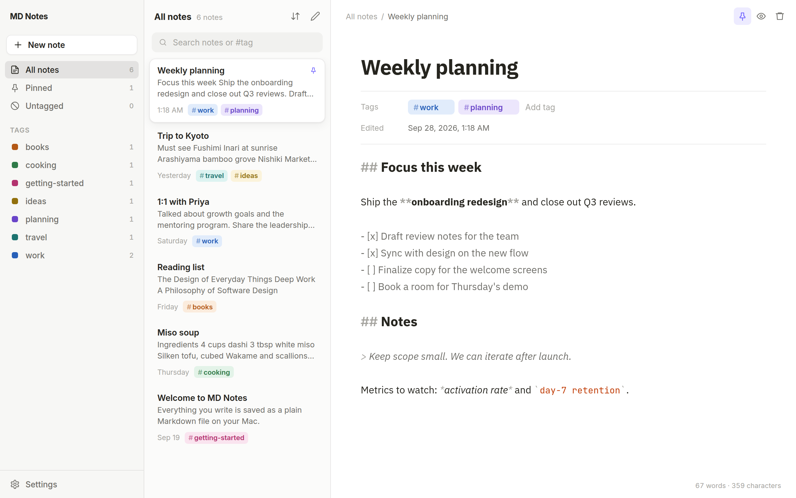
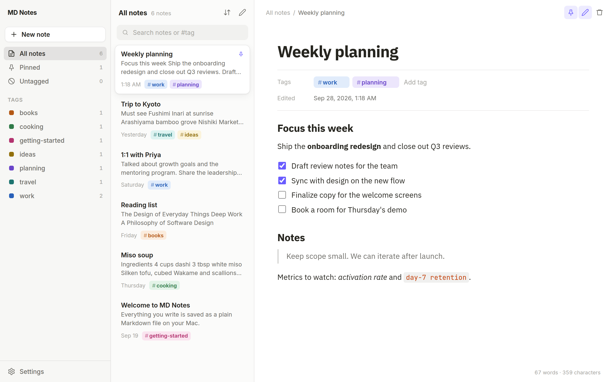
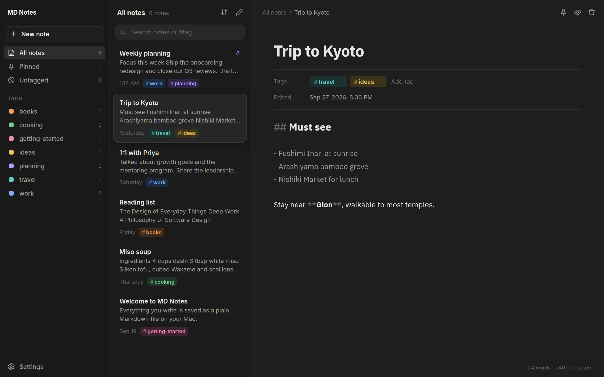
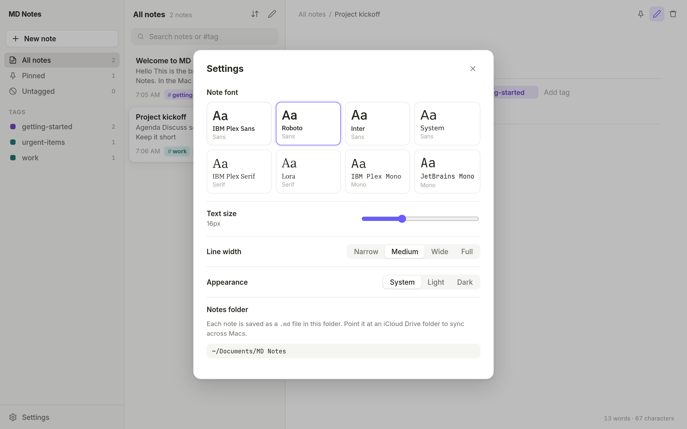
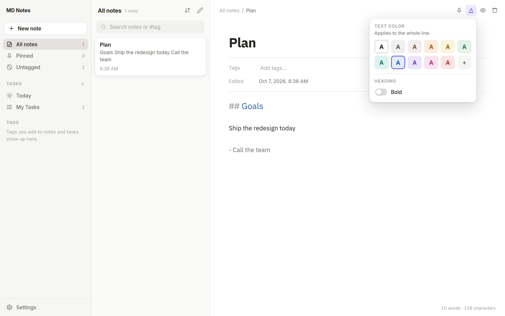
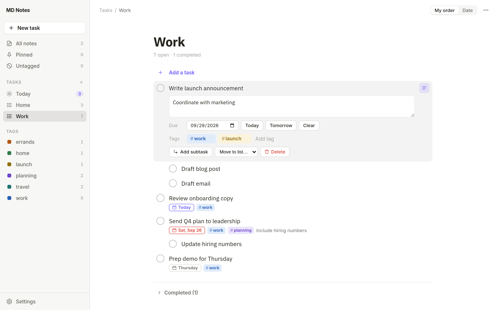
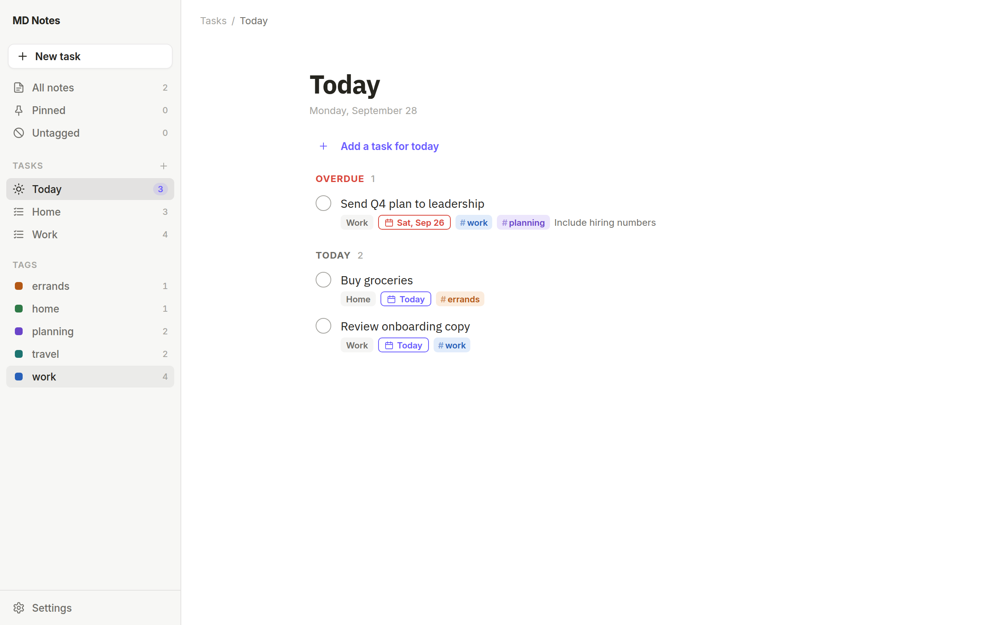
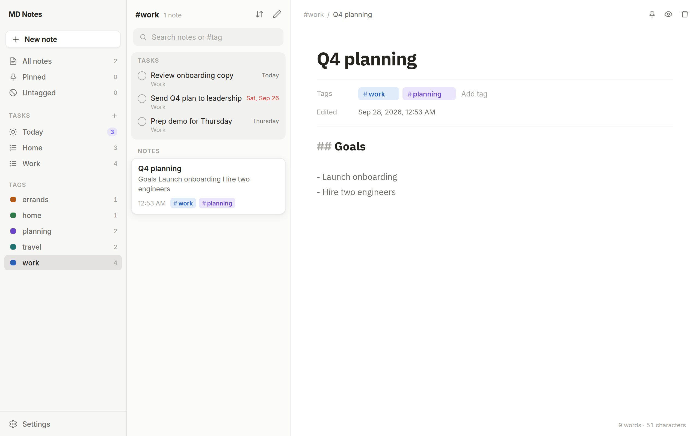

# MD Notes

A local-first Markdown notes and tasks app for macOS. This repo also contains a separate [Capacities → Google Doc backup script](#capacities--google-doc-backup). It has a clean, Capacities-style interface, Simplenote-fast note taking, colored tags, and bundled fonts such as IBM Plex Sans and Roboto.



## Features

- **Plain Markdown files on your Mac.** Each note is a `.md` file with YAML frontmatter in `~/Documents/MD Notes` by default. You can change the folder in Settings. Edits made in other editors show up live.
- **Fast capture.** `⌘N` creates a note and autosave runs as you type. Empty notes are discarded when you leave them. Search is instant and supports `#tag` filters.
- **Live Markdown editor.** Built on CodeMirror. Headings, bold, italics, links and code are styled as you type, and lists and checklists continue when you press Enter. `⌘E` switches to a rendered preview where you can tick checkboxes.
- **Text color.** Color a note's title, any line or heading, or selected words with the tag palette or any custom color, and turn bold off for the title or individual headings (see [Text color](#text-color)).
- **Tasks.** Google Tasks-style lists with subtasks, details, due dates and a Today view of everything overdue or due today. Each list is a plain Markdown file (see [Tasks](#tasks)).
- **Colored tags, shared by notes and tasks.** Add tags under a note's title or in a task's details (with autocomplete). Click a tag in the sidebar to see its open tasks and notes together. Right-click a tag to pick one of 10 colors, rename it, or delete it everywhere.
- **Fonts.** IBM Plex Sans, Roboto, Inter, IBM Plex Serif, Lora, IBM Plex Mono, JetBrains Mono and the system font are all bundled, so they work offline. You can also adjust text size and line width.
- **Light and dark themes**, pinned notes, sorting (last edited, created, title), and a word count.

| Preview | Dark mode |
| --- | --- |
|  |  |



## Text color



Click the **A** button in the editor toolbar (or press **⇧⌘C**):

- **Color:** pick one of the 10 palette colors, **+** for any custom color, or the plain **A** for the default color. With text selected, only the selection changes; otherwise the whole line does (list, task and heading markers stay as they are).
- **Heading bold:** with the cursor on a heading, the **Bold** switch turns bold off (or back on) for just that heading.
- **Note title:** with the cursor in the note's title (or while previewing), the menu colors the title and its **Bold** switch turns the title's bold off. These are saved per note in the frontmatter as `titleColor` and `titleBold: false`.

Formatting is saved as inline HTML, which is valid Markdown, so the file stays readable everywhere:

```markdown
## <span style="color: #2860b8; font-weight: normal">Goals</span>
Ship the <span style="color: #c1352b">redesign</span> today
```

In MD Notes the tags are hidden while you edit. Obsidian, Typora and VS Code show the colors too; apps that don't allow HTML (like GitHub) show the plain text. Palette colors switch to their dark-mode versions automatically; custom colors stay exactly as picked.

## Tasks



| Today | A tag shows its tasks and notes |
| --- | --- |
|  |  |

Task lists live in the `Tasks` folder inside your notes folder, one Markdown file per list (the filename is the list name). They use the same syntax as the [Obsidian Tasks](https://publish.obsidian.md/tasks/) plugin, so you can also read and edit them in Obsidian or any text editor:

```markdown
- [ ] Buy milk #errands 📅 2026-10-01
    Get the big carton if it's on sale
    - [ ] Oat milk
    - [x] Regular milk ✅ 2026-09-27
- [ ] Book dentist appointment #health
- [x] Return library books #errands ✅ 2026-09-26
```

- Tags are written inline (`#errands`), 📅 marks the due date and ✅ the completion date.
- Indented lines under a task are its details; indented checkboxes are its subtasks (one level).
- Completed tasks stay where they are in the file; the app shows them in a collapsible Completed section.
- Headings and other text you add to a list file by hand are kept. Edits made in other apps show up live.
- Deleted lists are moved to `.trash/Tasks` in the notes folder.

In a list: **Enter** adds the next task, **Tab** / **⇧Tab** turns a task into a subtask and back, **Backspace** on an empty task deletes it, and **↑** / **↓** move between tasks. Drag tasks to reorder them, or drop one on another list in the sidebar to move it. Leaving a new task empty discards it.

## Backing up to Google Drive

Install [Google Drive for desktop](https://www.google.com/drive/download/). It adds **Google Drive › My Drive** to Finder (at `~/Library/CloudStorage/GoogleDrive-<your account>/My Drive`). In MD Notes, open **Settings → Notes folder → Change…** and choose (or create) a folder there, such as `My Drive/MD Notes`. Your notes are then synced to Google Drive and still work offline. An iCloud Drive folder works the same way.

Changing the folder doesn't move existing notes. To bring them along, copy the `.md` files (and the hidden `.mdnotes` folder, which holds tag colors) into the new folder first.

## Note format

```markdown
---
title: Project kickoff
tags: [work, urgent-items]
pinned: true
titleColor: "#2860b8"   # only when the title has a color
titleBold: false        # only when the title isn't bold
created: 2026-09-26T07:05:00.000Z
updated: 2026-09-26T07:12:00.000Z
---

## Agenda
- [ ] Assign owners
```

The filename follows the title. Frontmatter keys the app doesn't know about are preserved. Deleted notes go to `.trash/` inside the notes folder. Tag colors are stored in `.mdnotes/tags.json`.

## Installing

Download the `.dmg`, drag MD Notes to Applications, and confirm the first launch. **[INSTALL.md](INSTALL.md)** walks through each step, including where to download the installer and how to publish a new release.

## Development

Requires Node.js 20+.

```bash
npm install
npm run dev      # run the app with hot reload
npm run dist     # build a .dmg into release/
```

`npm run dev:web` runs the UI in a browser with a localStorage-backed store, which is handy for UI work. `npm test` runs the storage and task tests.

## Keyboard shortcuts

| Shortcut | Action |
| --- | --- |
| `⌘N` | New note (or new task in Tasks) |
| `⌘1` | Notes |
| `⌘2` | Today |
| `⌘F` | Search notes |
| `⌘E` | Toggle preview |
| `⇧⌘C` | Text color and bold (title, headings, text) |
| `⇧⌘P` | Pin / unpin |
| `⌘⌫` | Move to trash |
| `⌘\` | Toggle sidebar |
| `⌘,` | Settings |

In search, `↑`/`↓` moves through notes and `Enter` jumps into the editor. In the title, `Enter` jumps to the body.

## Project layout

- `electron/main.cjs`: app window, native menu, IPC, folder watcher
- `electron/store.cjs`: reads and writes note files (unit tested in `test/`)
- `electron/tasks.cjs`: reads and writes task list files
- `shared/tasks.mjs`: parses and writes the task Markdown format and implements every task operation; used by both the main process and the UI
- `electron/preload.cjs`: the narrow `window.notesApi` bridge
- `src/`: React UI (`App.tsx`, `tasks/` for the task views, CodeMirror `Editor.tsx`, `Preview.tsx`, `TagInput.tsx`, `SettingsDialog.tsx`, fonts and tag palette in `theme.ts`)

## Capacities → Google Doc backup

Backs up new [Capacities](https://capacities.io) notes by appending them to a Google Doc.

`capacities_backup.py` runs hourly via GitHub Actions. Each run lists the objects in your
Capacities space, finds the ones it hasn't backed up yet, fetches each one as Markdown, and
appends it to the end of your Google Doc. Each note gets a heading (the title), a line with
the creation date, type, and ID, and then the note body. The IDs of backed-up notes are kept
in `state/backed_up.json`, which the workflow commits back to the repo, so no note is appended
twice.

### Setup

1. **Capacities API token.** In Capacities, go to *Settings → Capacities API* and create a
   token for the space you want to back up. You need a Capacities Pro plan for this.
2. **Google service account.**
   1. In [Google Cloud Console](https://console.cloud.google.com/), create a project (or use an
      existing one) and enable the **Google Docs API**.
   2. Go to *IAM & Admin → Service Accounts*, create a service account, and download a JSON key
      for it (*Keys → Add key → JSON*).
3. **Google Doc.** Create the doc and share it with the service account's email address
   (`…@….iam.gserviceaccount.com`) with **Editor** access. The doc ID is the long string in the
   URL: `docs.google.com/document/d/<DOC_ID>/edit`.
4. **Repository secrets.** Under *Settings → Secrets and variables → Actions*, add:

   | Secret | Value |
   | --- | --- |
   | `CAPACITIES_API_TOKEN` | the token from step 1 |
   | `GOOGLE_SERVICE_ACCOUNT_JSON` | the full contents of the JSON key file |
   | `GOOGLE_DOC_ID` | the doc ID from step 3 |

   Optionally, add a repository **variable** named `CAPACITIES_STRUCTURE_IDS` with a
   comma-separated list of object types to back up, such as `RootPage,RootDailyNote,<custom-type-uuid>`.
   If you don't set it, every type is backed up except system and media types (tags,
   queries, collections, images, PDFs, and so on).
5. **First run.** Under *Actions → Capacities → Google Doc backup*, click *Run workflow*.
   - By default, the first run records every note you already have as the baseline without
     appending anything. After that, only notes created later are appended.
   - To start with a full backup instead, tick **include_existing**. Capacities limits the API
     to about 30 requests per minute, so a large space can take a while to back up.

### Behaviour

- A note is appended only after it hasn't been edited for `MIN_AGE_MINUTES` (default 30). This
  keeps half-written notes out of the doc. They're picked up on a later run.
- A note is appended **once**, when it is new. Later edits to it are not re-synced.
- New notes are appended oldest first. The state file is saved after each note, so if a run
  fails partway through, the next run doesn't duplicate what was already appended.
- A Google Doc holds about 1.02 million characters at most. If your backup gets close to that,
  create a new doc and update `GOOGLE_DOC_ID`.

### Running locally

```bash
pip install -r requirements.txt
export CAPACITIES_API_TOKEN=...
export GOOGLE_DOC_ID=...
export GOOGLE_SERVICE_ACCOUNT_JSON="$(cat key.json)"
python capacities_backup.py --dry-run   # show what would be appended
python capacities_backup.py             # do it
```

Options: `--include-existing`, `--min-age-minutes N`, `--limit N`, `--dry-run`,
`--state-file PATH`.

Tests: `pip install pytest && python -m pytest tests`.
